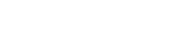

# Simulasi Paper Extreme Learning Machine: Theory and applications
### oleh Oddy Virgantara Putra

[The original paper](https://doi.org/10.1016/j.neucom.2005.12.126) is authored by Guang-Bin Huang 

## Iris Flower Classification

In [main.py](main.py), the ELM algorithm is implemented to tackle a task such as Iris flower classification. 
ELM proposed a concept called Single-hidden Layer Feedforward Network (SLFN).
This network is simply a network with only an input layer, a hidden layer, 
and an output layer. 

## SLFN

SLFN can be written mathematically as:

